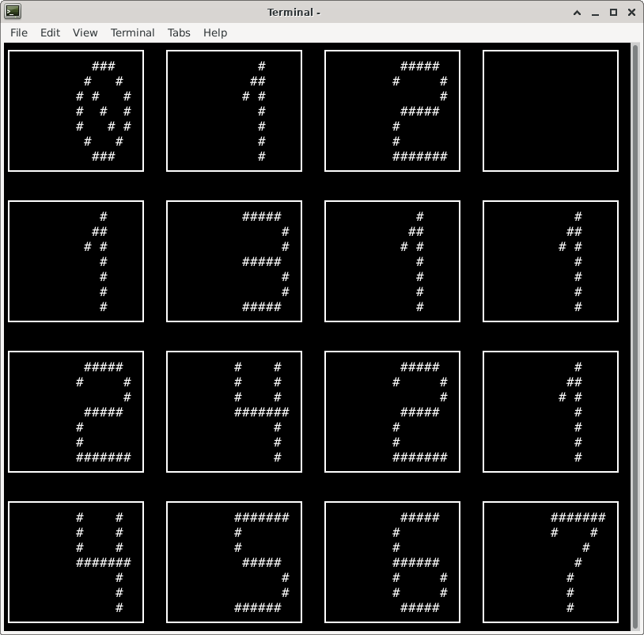

### 123 is a console 2048 game clone.  
To compile: g++ -o 123 -std=c++11 123.cpp -lncurses
It has two interfaces: stealth mode and large mode.  
To sart in large mode type "123 I am batman" :)  
Use up/down/left/right arrows, q to quit.  
After you quit, the score will be displayed.  

  

  

